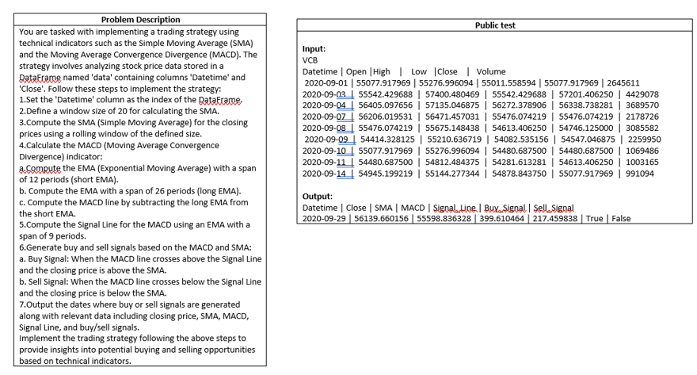
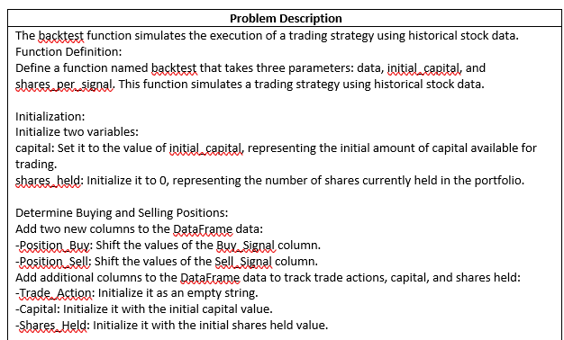
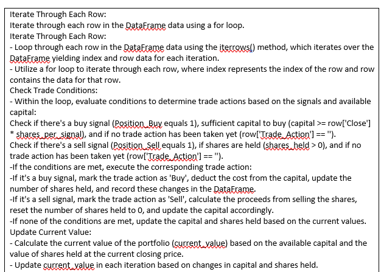
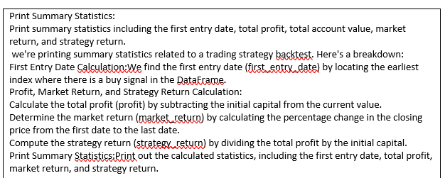
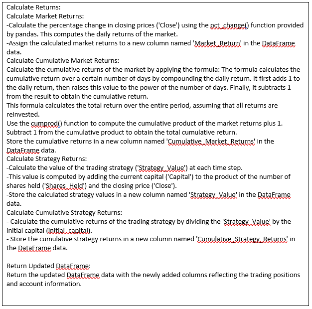
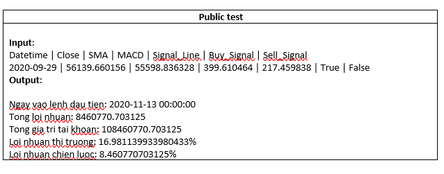

# Using alphacodium for trading strategy and backtest
GVHD: TS. Ngô Minh Mẫn

Student:

(1) Lương Như Ý - MSSV: 22C01029

(2) Trương Quỳnh Như - MSSV: 22C01012

(3) Trần Thị Lan Anh - MSSV:22C01002

(4) Lê Hoài Thanh - MSSV:22C01018


## Architecture


## Installation
(0) clone AlphaCodium Github:`git clone https://github.com/Codium-ai/AlphaCodium.git`

(1) setup a virtual environment and run: `pip install -r requirements.txt`

(2) Duplicate the file `alpha_codium/settings/.secrets_template.toml`, rename it as `.secrets.toml`, and fill in your OpenAI API key:
```
[openai]
key = "..."
```

### Solving a new problem (CodeContest format)
To solve a custom problem with AlphaCodium, first create a json file that includes the CodeContest problem fields, and then from the root folder run:
```
python -m alpha_codium.solve_my_problem \
--my_problem_json_file /path/to/my_problem.json
```
- The `my_problem_json_file` is the path to to the custom problem json file.

See the `my_problem_example.json` to see an example of a custom problem. The json file should include the following fields:
- `name` is the name of the problem.
- `description` is a description of the problem.
- (optional) `public_tests` with the following fields:
  - `input` is a list of strings that represent the input.
  - `output` is a list of strings that represent the output.
- (optional) `private_tests`, that follows the same structure as `public_tests`
- (optional) `generated_tests`, that follows the same structure as `public_tests`


Trading strategy problem
<p align="center">
 <table class="tg">
  <tr>
    <td class="tg-c3ow"></td>
    </tr>
</table>
</p>


Backtest problem
Problem Description
<p align="center">
 <table class="tg">
  <tr>
    <td class="tg-c3ow"></td>
    </tr>
</table>
</p>
<p align="center">
 <table class="tg">
  <tr>
    <td class="tg-c3ow"></td>
    </tr>
</table>
</p>
<p align="center">
 <table class="tg">
  <tr>
    <td class="tg-c3ow"></td>
    </tr>
</table>
</p>
<p align="center">
 <table class="tg">
  <tr>
    <td class="tg-c3ow"></td>
    </tr>
</table>
</p>
Problem Example
<p align="center">
 <table class="tg">
  <tr>
    <td class="tg-c4ow"></td>
    </tr>
</table>
</p>


## How to run
```bash

python -m alpha_codium.solve_my_problem --my_problem_json_file D:/UngdungNLP/AlphaCodium/my_problem_example_Y_stock.json >
 output_tradingstrategy.txt

python -m alpha_codium.solve_my_problem --my_problem_json_file D:/UngdungNLP/AlphaCodium/my_problem_example_Y_backtestv3.json > output_backtest.txt
```

## Compare between normal code and alphacodium generating code
In the `Compare_normal_vs_alphadiumcode.ipynb` i use both normal code and alphacodium generating code apply for the real VCB stock to compare the result. The result is the same. So alphacodium has do a good job in generating code from proposed flow.